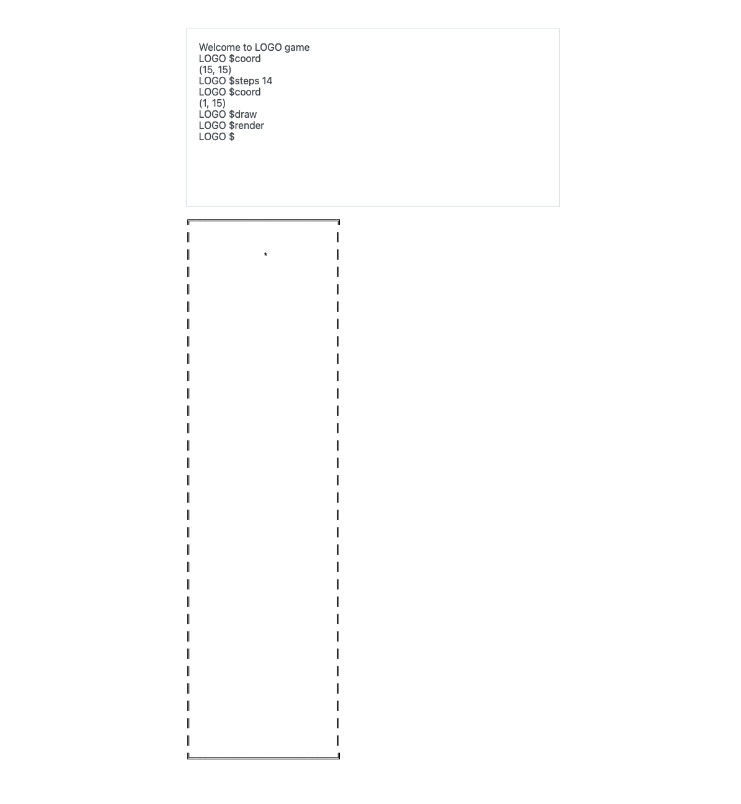

#LOGO Backend execise

A game with terminal to draw the result as you want with nestjs and angular.

## Dev

This is a monorepo of nestjs and angular.

If you want to run it:

1. Make sure you have `npm` and `nx` installed, since it's a nx workspace. The project was created with node v16.20.1 and angular v16.
2. Run `npm install` to install packages. (if you get error when install cypress [ we are not really use it in this project but if we want to make further e2e test we can work it there ], make sure you disable the proxy security software such like: zscaler);
3. Start server by : `npm run serve` to start the server.
4. Start client by: `npm run dev` to start the angular application where you can play with a terminal and visualize the result.
5. Go to browser with `localhost:3000`. Just play with it!

If you want to perform the test. Please check the `readme.md` in project `front_starter_code`

## Main features

1. a nestjs server with a websockt api to parse and execute the command received from the user.
2. a simple angular application which can react with the websockt api.

More details of backend.  

The main logic of the backend located in [apps/server/src/app/](./apps/server/src/app/) folder.  
The [logo-backend.gateway.ts](./apps/server/src/app/logo-backend.gateway.ts) takes the responsibility to handle websocket connection. It is `ws` style as nestjs websocket is built on top of `ws`.  
The [logo-backend.service.ts](./apps//server/src/app//logo-backend.service.ts) takes the responsibility to parse and execute the command.

## Script Command in package.json

`dev`: start a watch to angular project.  
`serve`: start a watch to nestjs server. 
`format`: format all your code.

## Variable in `.env`

See the comments in the `.env.template` file
